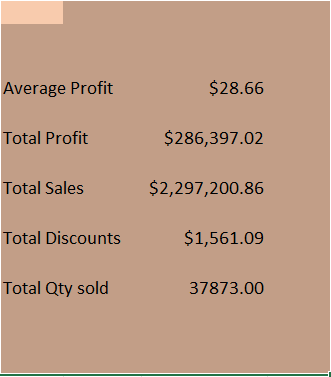
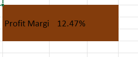
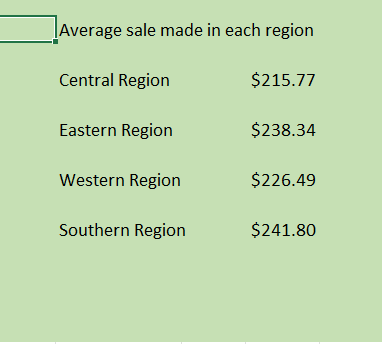
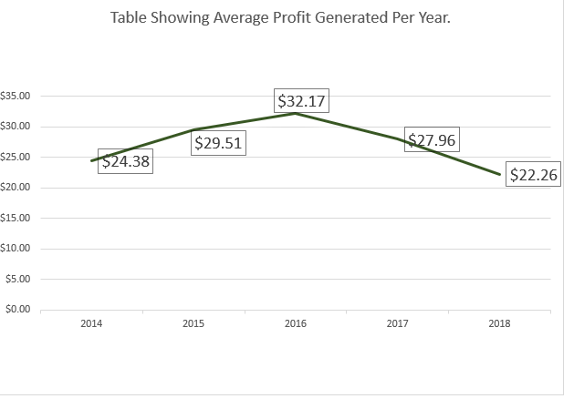
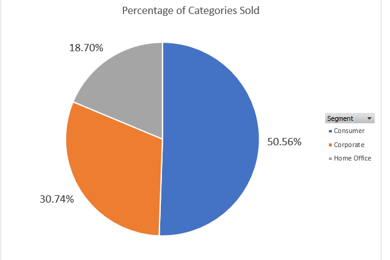
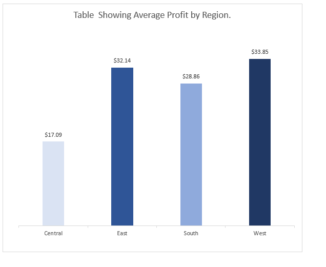
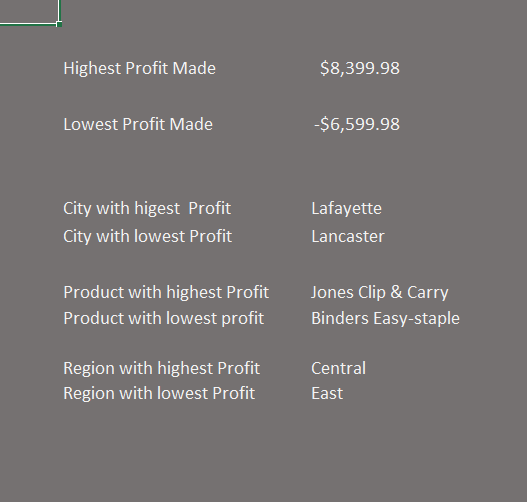

# Superstores Analysis.

## Introduction
This is a project to analyze sales data of an imaginary e- commerce company. The data analysed was entered in an excel spreadsheet and it was analysed using excel analytics formats. The data was analysed to help identify some important Key Performance indicators so as to influence important business decisions.
### *Disclaimer*: The data analysed does not represent any company, country or institutions. Its just a dummy data set to show the capabilities of analysing data using excel.
## Problem Statement
1.	From the data, find the average profit made, total sales(revenue), total discounts given, total profit generated, and total quantity of goods sold.
2.	From the data, find the profit margin of the company.
3.	Find the average sale made from each region.
4.	Show the average profit generated per year.
5.	Show the percentage of each category.
6.	Show the average profit made in each region.
7.	Show the city, region and product with the highest and lowest profits.
### Tools/functions used: 
To analyse this data the following excel functions were used;
1.	Basic excel functions such as sum, Average, min etc.
2.	Advanced functions such as vlookup, Sumif etc.
3.	Pivot table.
4.	Data visualizations such as pivot charts.
## Analysis
### Revenue:
The first image contains the total revenue( total sales ) generate by the organisation on all its products over the course of 4 years. The image also contains the average profit, total profit, total quantity of goods sold and total discounts given by the organisation. The values were arrived at by using the sum functions on excel. However, the average profit was arrived by using the average funtion and the quantity sold arrived at by the count function on excel.

### Profit Margin:
This is the valaue represents the percentage of revenue retained by the organisation as profit after all other expenses have been deducted. It is calculated by dividing the total profit by the total revenu and then converting it to percentage.

### Average Sale from each region: 
The table below shows the avarage sale made on all producs by the comapny. From the table, it can be seen that the southern region had the highest average sale while the central region had the lowest.

### Averege Profit per year: 
This table shows the average profit made by the organization in the four years that records were taken. A line chart was used to visualize the data and from the data, 2016 had the highest average profit while the lowest avaerage profit was recorded 2018.

### Percentage of Each Category: 
This table shows the percentage of each category in the total sale. A pie chart created on excel was used to showcase this and the consumer goods category had a 50% of the total percentage.

### Average Profit Per Region:
The next image which is a colum chart was created to visualize the average profit made by each region over the course of 4 years. From the colunm chart, it can be observed that the western region had the highest averahe profit while the central region had the lowest.

### Highest and Lowest Profits:
The image below is to show the highest profit made and the lowest profit made. It also highlighted the city,region and the products that recorded the highest and lowest profits. It can be ovebserved that the lowest profit recorded was -$6,599.98 and the product was Binders Easy Staple.

## Conclusion
After analysing the data, I was able to showcase some important KPIs and highlight areas that needed improvement. Analysing this data shows that excel can be used to analyse data almost as much as other data analytics tools. 

